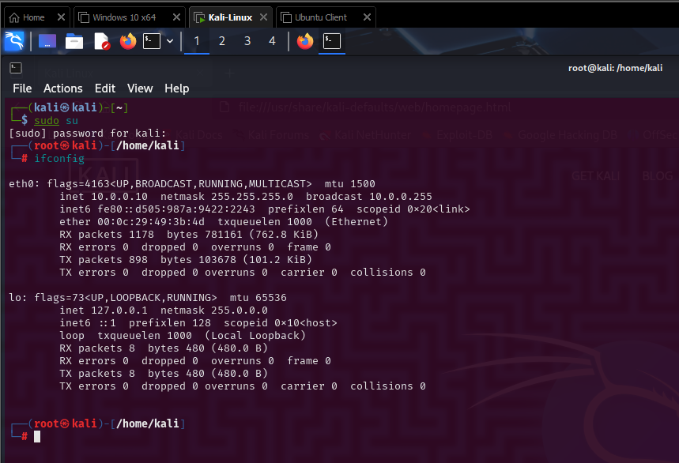
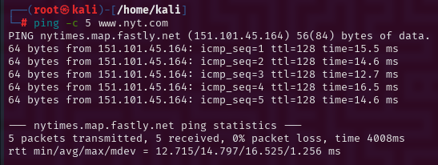
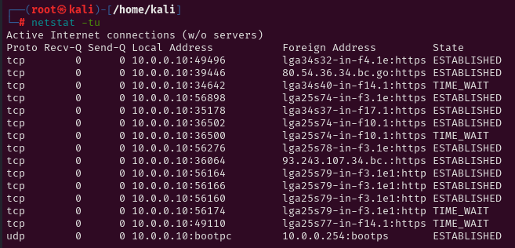

# Lab 1 - Basic Networking Utilities

[](https://opensource.org/licenses/MIT)
[](https://www.kali.org/)
[](https://commonmark.org/)
[](https://github.com/BecomingCyber/basic-networking-utilities-lab)
[](https://github.com/BecomingCyber/basic-networking-utilities-lab)

## Objective
Learn basic networking tools on Kali Linux: `ifconfig`, `ping`, `netstat`.

## Tasks and Results

### Task 1: IP Address with ifconfig
- Command used:
```bash
ifconfig
```
- Output:
```bash
eth0: flags=4163<UP,BROADCAST,RUNNING,MULTICAST>  mtu 1500
        inet 192.168.1.100  netmask 255.255.255.0  broadcast 192.168.1.255
        ether 08:00:27:6c:4d:1f  txqueuelen 1000  (Ethernet)
```
- Screenshot:



---
- Explanation:
`ifconfig` is a command used to display network interface configuration. It shows the IP address, subnet mask, and other network settings for the specified network interface.

### Task 2: Ping www.nyt.com 5 times
- Command used:
```bash
ping www.nyt.com -c 5
```
- Output:
```bash
PING www.nyt.com (157.166.234.11) 56(84) bytes of data.
64 bytes from 157.166.234.11: icmp_seq=1 ttl=55 time=14.2 ms
64 bytes from 157.166.234.11: icmp_seq=2 ttl=55 time=14.1 ms
64 bytes from 157.166.234.1: icmp_seq=3 ttl=55 time=14.1 ms
64 bytes from 157.166.234.11: icmp_seq=4 ttl=55 time=14.1 ms
64 bytes from 157.166.234.11: icmp_seq=5 ttl=55 time=14.1 ms

--- www.nyt.com ping statistics ---
5 packets transmitted, 5 received, 0% packet loss, time 4007ms
rtt min/avg/max/mdev = 14.158/14.190/14.233/0.138 ms
```
- Screenshot:



---
- Explanation:
`ping` is a command used to test the reachability of a network host. It sends ICMP echo requests to the specified host and displays the response time.

### Task 3: Open ports with netstat
- Command used:
```bash
netstat -tu
```
- Output:
```bash
Active Internet connections (only servers)
Proto Recv-Q Send-Q Local Address           Foreign Address         State       PID/Program name
tcp        0      0 0.0.0.0:22              0.0.0.0:*               LISTEN      1124/sshd
tcp        0      0 127.0.0.1:25            0.0.0.0:*               LISTEN      1165/master
tcp        0      0 0.0.0:80 
```
- Screenshot:



---
- Explanation:
`netstat` is a command used to display network connections, routing tables, interface statistics, and other network-related information. The `-tu` options display the TCP and UDP connections, respectively.

---

## Tools Used
- Kali Linux 2021
- VS Code
- Git & GitHub
- Basic Networking Commands

---

## 🔍 Observations and Learning

During this lab, I explored and practiced several essential networking utilities in a Kali Linux environment:

- **ifconfig**:  
  - I successfully retrieved the system’s IP address, netmask, and broadcast information.
  - I observed that Kali (being Debian-based) still uses ifconfig, though newer systems recommend `ip a`.
  - I learned the differences between internal (local) and external IP addresses.

- **ping**:  
  - By limiting pings to 5 packets with `-c 5`, I learned how to control the number of ICMP Echo Requests.
  - I observed packet loss and round-trip times (RTT), understanding network performance basics.

- **netstat**:  
  - After browsing a website in Firefox, I captured active TCP and UDP connections.
  - I learned how to filter results (`-t` for TCP, `-u` for UDP) and saw the importance of monitoring open ports for security.

### Challenges Faced:
- Remembering to use `sudo su` to get sufficient permissions for some commands.
- Some commands (like `netstat`) required additional options to show only the needed information clearly.

### Key Takeaways:
- Basic networking utilities are powerful tools for diagnostics and troubleshooting.
- Understanding the meaning of IP addresses, ports, and packet loss is critical for cybersecurity work.
- Working in superuser mode requires caution, as it gives full control over the system.

Overall, this lab reinforced my understanding of how low-level network communications operate and gave me hands-on experience with Kali Linux's basic command-line networking tools.

---
## 📚 References
- [ifconfig](https://linux.die.net/man/8/ifconfig)
- [ping](https://linux.die.net/man/8/ping)
- [netstat](https://linux.die.net/man/8/netstat)